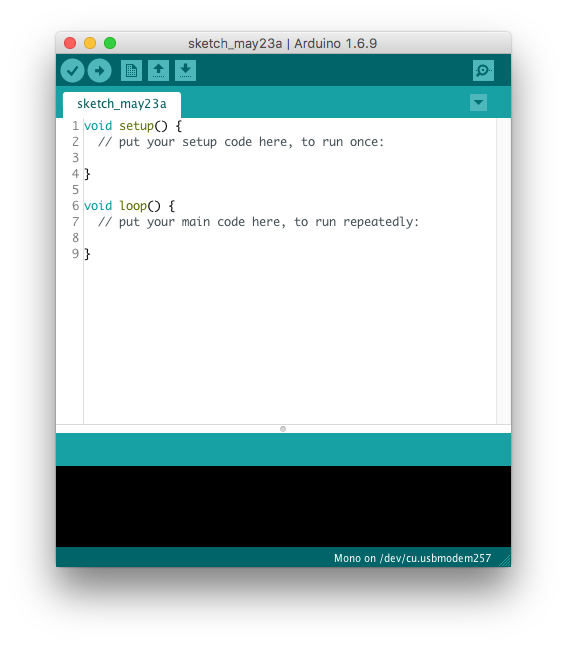

# Hvad er Arduino og Arduino IDE

Arduino er en en digitaludviklingsplatform. Det er et elektronikkort \(printkort\), som indeholder en meget lille processor. Foremålet med Arduino er at give elektronikentusiaster lettere mulighed for at udøve deres hobby.

Siden har kunstnere og virksomheder taget Arduino til sig, så det i dag er blevet de-facto standarden inden for elekroniknær softwareudvikling.

Til at lægge programkode ned i Arduinos processor, bruger man et program kaldet *Arduino IDE*. Programmet er gratis og virker på alle platforme (Windows, Mac & Linux). Vi bruger samme program til at ligge programkode ned i Mono.

På billedet ses hvordan vinduet i *Arduino IDE* ser ud, når det kører på Mac.