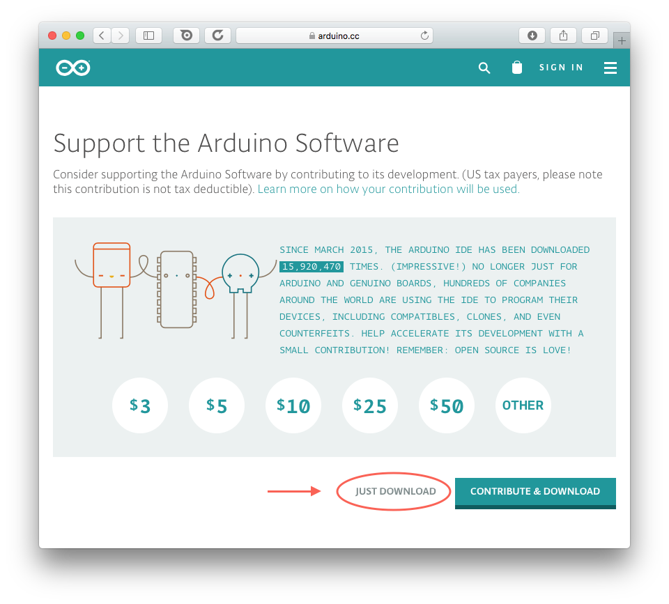

# Installering på Mac

Første skridt til at installere *Arduino IDE* på macOS, er at donloade programmet fra Arduino's website. Programmet er gratis, men Arduino forsøger dog at få lidt støtte koorner ved at presenterer en donationsmulighed, inden du kan downloade programmet. Tryk på linket nedenfor, for at gå til denne download skærm:

**[Download Arduino IDE til Mac](https://www.arduino.cc/download_handler.php?f=/arduino-1.8.2-macosx.zip)** (fra [www.arduino.cc](https://www.arduino.cc))

Om du ønsker at donere penge til Arduino er dig frit for, det er på ingen måde påkrævet. Ønsker du bare at komme igang, så klik på *Just download* og download'en begynder. Filen der hentes er en ZIP fil, som alt efter hvilken browser du bruger automatisk bliver pakket ud.

Ovenfor ses hvordan *Docken* ser ud hvis Arduino IDE blev udpakket automatisk. HVis du istedet ser et fil-ikon med en lynlås på, så skal to åbne denne fil for at pakke den ud. Herefter skulle du gerne se det blågrønne Arduino ikon.

Sidste trin er at flytte programmet fra *Downloads* mappen og ind i mappen med programmer:

