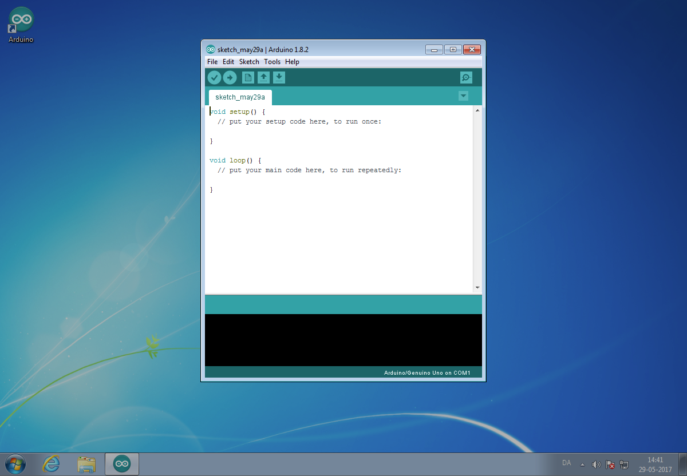
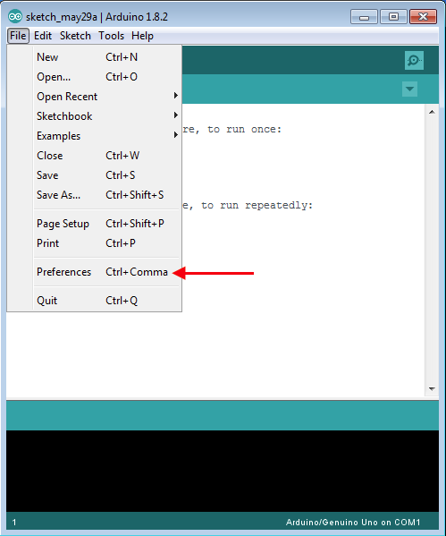
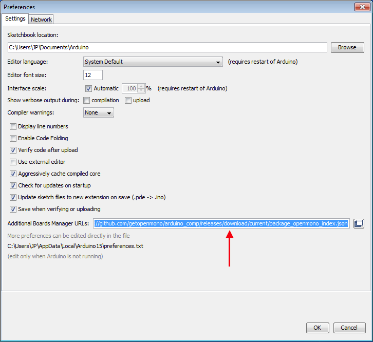
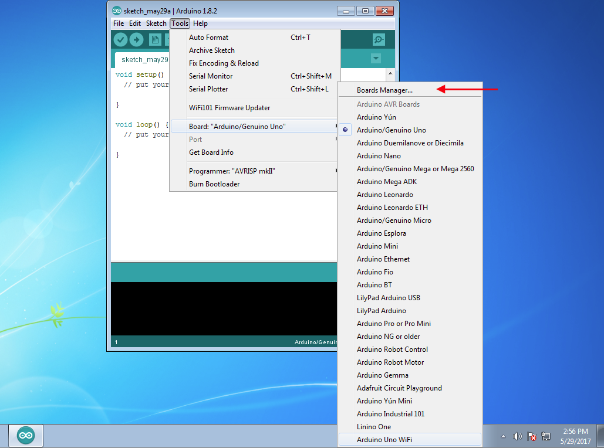
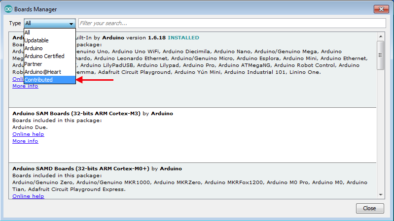
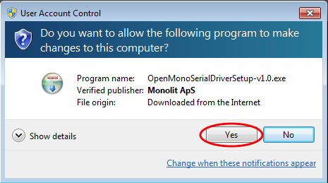
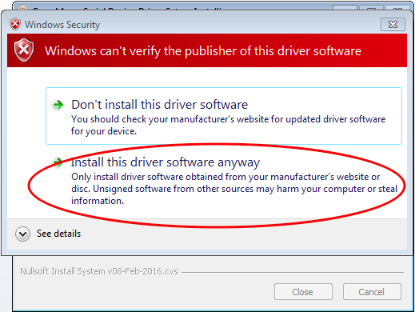

# Installing af Mono-udvidelsen

For at *Arduino IDE* kan snakke med Mono og bygge programkode som passer til, så skal vi først tilføje en udvidelse til programmet. Udvidelsen tilføjer understøttelse af Mono og tilhørende undervisningsmateriale.

Efter at have installeret *Arduino IDE*, skal du nu åbne programmet. Når det har loaded ser du et vindue som dette: (Der er en lille variation mellem Arduino IDE på Mac og Windows.)



#### Tilføj adresse på udvidelsen

Vi benytter os af *Arduino IDE*'s mulighed for at installere og administrere udvidelser - kaldet *Board Manager*. Først skal vi tilføje et link til Board Manageren, så den kender til Mono-udvidelsens eksistens.

På Windows valkg menuen *File* og derefter *Preferences*:



På Mac skal du vælge menuen *Arduino IDE* og så punktet *Preferences*. (Alternativt kan du trykke: `cmd + ,`.)

Nu vises *Preferences*-vinduet, hvor du skal *Copy-Paste* denne tekst ind i feltet kaldet: *Additional Board Manager URLs*

```
https://github.com/getopenmono/arduino_comp/releases/download/current/package_openmono_index.json
```

Således at du ender med at have teksten stående i feltet, som vist nedenfor:



Klik på knappen *OK*.

#### Download og installer

Nu skal vi åbne *Board Manager* ved at vælge menuen *Tools*, så punktet *Board: Arduino/Genduino Uno* og sidst *Board Manager*.



Nu vises *Board Manager*, og den downloader de nyeste udvidelser til *Arduino IDE*. Fordi vi har tilføjet en URL på Mono-udvidelsen, bliver en beskrivelse af denne nu også downloaded. For lettere at finde den kan du vælge *Contributed* i boksen *Type*:



Herefter ses vores udvidelse kaldet *OpenMono*. Tryk på knappen *Install* for at downloade og installere Mono-udvidelsen. Når installationen er færdig skal du trykke på knappen *Close*.

#### Installer Mono USB drivere

> _Bruger du Mac skal du blot springe dette afsnit over, og gå til [Et programeksempel]()_

Hvis du bruger Windows skal vi lige igennem et ekstra trin, inden vi er helt klar. Windows skal have installeret USB drivere til Mono. Desværre kan USB driveren ikke installeres med Mono-udvidelsen, da den kræver administrator rettigheder.

Først, download driver installationen her:

**[Mono USB Driver til Windows](https://github.com/getopenmono/arduino_comp/releases/download/1.1/OpenMonoSerialDriverSetup-v1.0.exe)**

Når du åbner installationsfilen ser du muligvis dette vindue:



Tryk på *Ja* eller *Yes* for at starte installationen. Herefter vil du blive præsenteret for et vindue hvor du skal godkende installation af selve driveren. På Windows 7 kan den se sådan ud:



På eksemplet her advarer Windows mod at driveren er farlig. Dette skyldes at vi, for eksemplets skyld, har brugt en gammel Windows 7 version, som ikke er blevet opdateret. Derfor kender Windows ikke til driverens ophav, og klassificerer den som farlig. *Det er den ikke!*

Nyerere eller opdaterede versioner af Windows vil stadig bede dig godkende installation af driveren, dog med en mere afdæmpet dialogboks.

Tryk på _**Install**_ eller _Install this driver software anyway_ for at fortsætte.

Herefter er USB driveren installeret og du er klar til at bruge Mono! 

