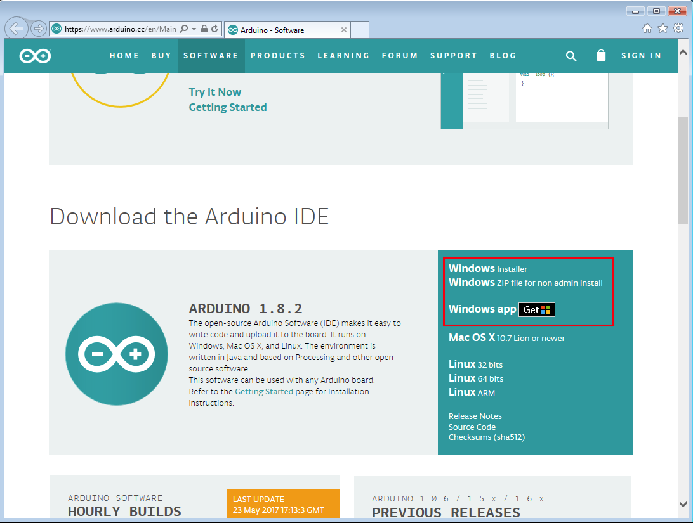
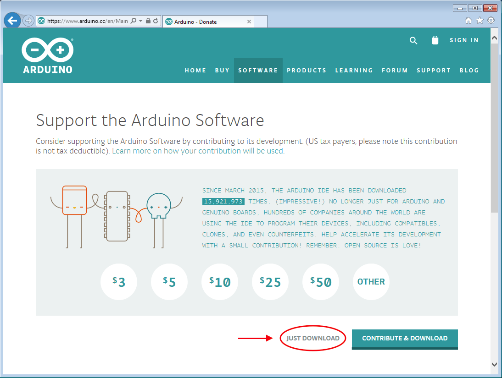
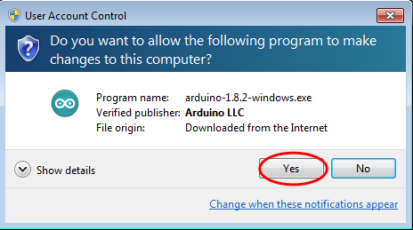
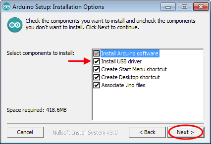
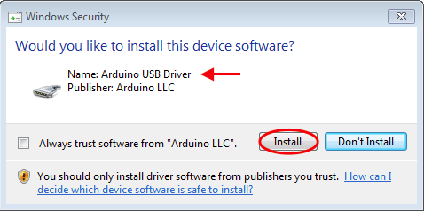
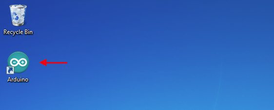

# Installering på Windows

For at installere *Arduino IDE* skal vi først downloade programmet fra Arduinos website. Der er 3 forskellige varianter Windows brugere kan vælge imellem:

Du skal vælge den første: _**Windows** Installer_. Den kræver dog at du har administrator rettigheder på computeren. Rådfør dig med skolens IT ansvarlige omkring administrator rettigheder, og muligheden for at bruge de andre varianter.

#### Download

Programmet er gratis, men Arduino forsøger dog at få lidt støtte koorner ved at presenterer en donationsmulighed, inden du kan downloade programmet. Tryk på linket nedenfor, for at gå til denne download skærm:

Om du ønsker at donere penge til Arduino er dig frit for, det er på ingen måde påkrævet. Ønsker du bare at komme igang, så klik på *Just download* og vælg *Gem* eller *Kør* filen på computeren. (Alt efter hvilken browser du bruger.)

Hvis du har vælg at denne filen skal du åbne den når den er downloaded. Du kan gøre dette direkte fra download vinduet, eller ved at åbne filen fra den mappe hvor du har gemt den.

Når du åbner installationen vil muligvis få vist advarslen vist ovenfor. Tryk på *Ja* eller *Yes*.

#### Installation

Nu starter installations guide og du skal trykke på knappen *Next*, indtal du får vist denne skærm:

Her kan du vælge hvad der skal installeres. Det står dig frit for om du vil installere *USB Driver* delen. Mono skal *ikke* bruge Arduino's USB drivere. For at forsætte, tryk på *Next*.

Nu bliver Arduino IDE installeret på computeren. Hvis du har valg at installere *USB Driver*, så kommer denne pop-up et par gange:

Vælg knappen *Install* for at installere driverene. (Denne pop-up vises flere gange, vælk *Install* hver gang.)

Når installationen er fældig skal du trykke på knappen *Close*, og installationsprogrammet lukkes. Nu har du et Arduino ikon på skrivebordet:

Nu er Arduino IDE installeret og næsten klar til at programmere Mono. Sidste skridt er at installere Monoudvidelsen. 