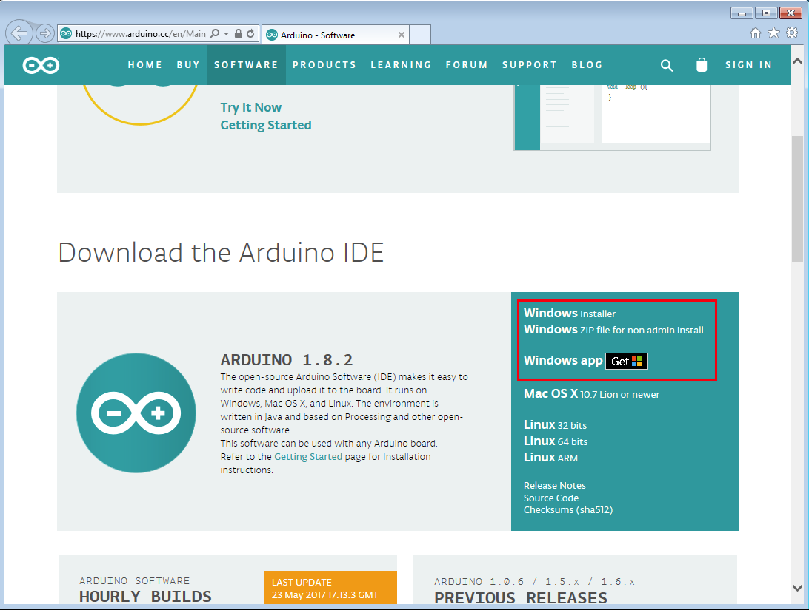
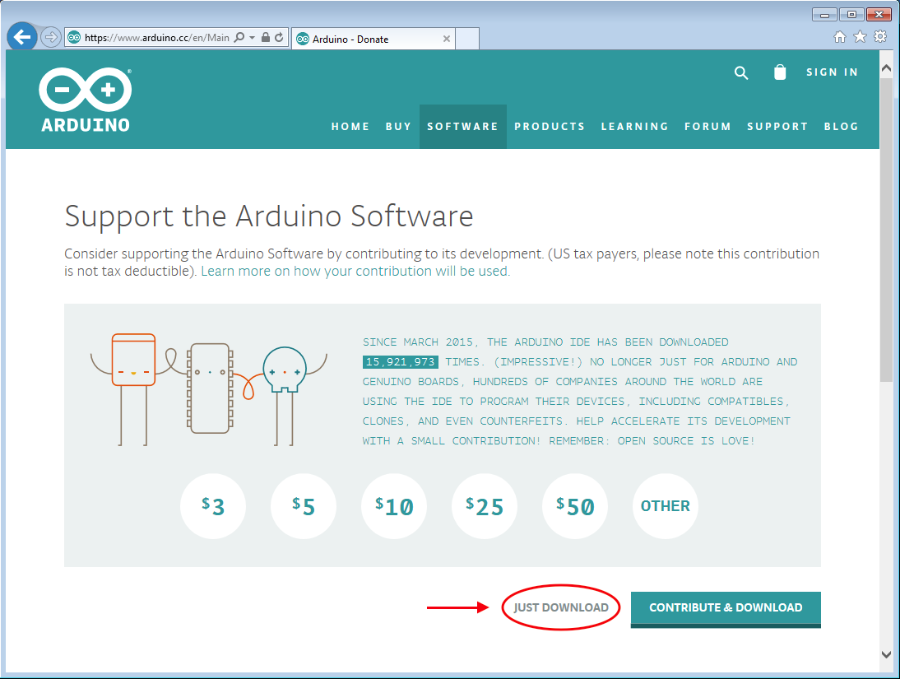

# Installering på Windows

For at installere *Arduino IDE* skal vi først downloade programmet fra Arduinos website. Der er 3 forskellige varianter Windows brugere kan vælge imellem:

Du skal vælge den første: _**Windows** Installer_. Den kræver dog at du har administrator rettigheder på computeren. Rådfør dig med skolens IT ansvarlige omkring administrator rettigheder, og muligheden for at bruge de andre varianter.

#### Download

Programmet er gratis, men Arduino forsøger dog at få lidt støtte koorner ved at presenterer en donationsmulighed, inden du kan downloade programmet. Tryk på linket nedenfor, for at gå til denne download skærm:

Om du ønsker at donere penge til Arduino er dig frit for, det er på ingen måde påkrævet. Ønsker du bare at komme igang, så klik på *Just download* og download'en begynder.