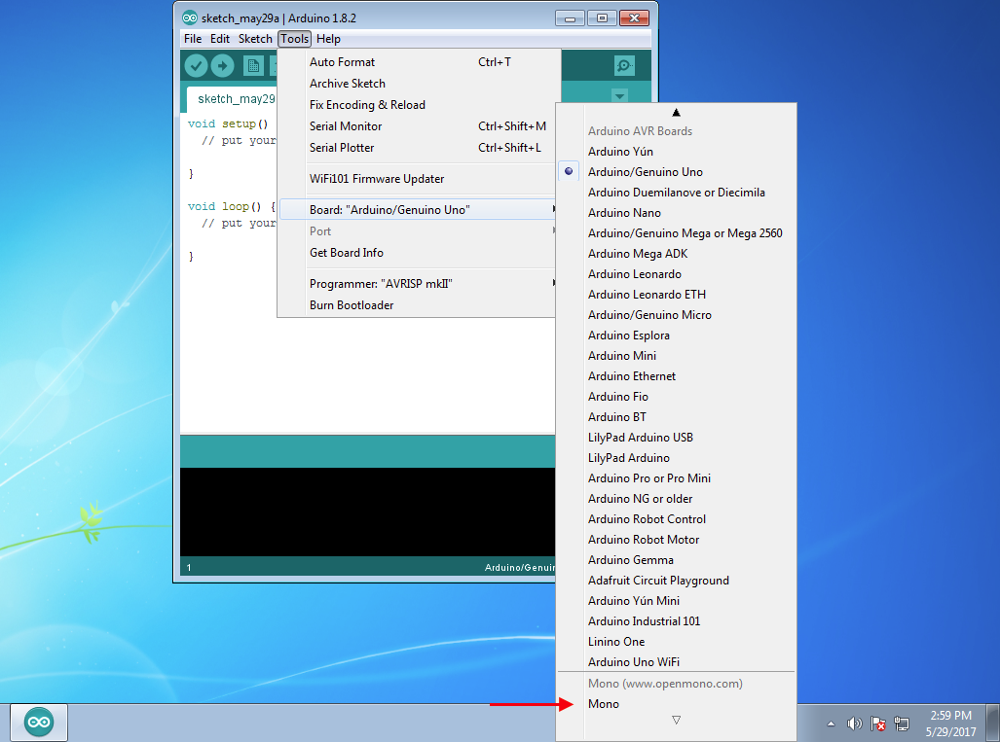
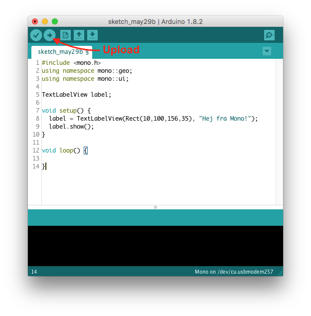

# Et programeksempel

Nu hvor vi har installeret *Arduino IDE* og tilføjet Mono-udvidelsen så lad os gennemgå et eksempel på hvordan man programmerer Mono.

Vi vil skrive et lille program der viser et stykke tekst på Mono's skærm. Der indbefatter at vi skriver programkoden i *Arduino IDE* og derefter *uploader* programmet til Mono via USB.

#### Åbn Arduino IDE

Åbn programmet *Arduino IDE* for at starte et nyt program-projekt. Nu får du vist et blågrønt vindue hvor der står noget forudfyldt kode i:

```cpp
void setup() {
  // put your setup code here, to run once:

}

void loop() {
  // put your main code here, to run repeatedly:

}
```

Dette er udgangspunktet for alle arduinoprogrammer. Der er 2 funktioner: `setup` som bliver kaldt een gang og `loop` som herefter bliver kald igen og igen.

#### Basalt eksempel med `setup` og `loop`

Hvis man for eksempel vil lave et program der tæller en variabel op, kunne man bruge `setup` til at sætte sin variabel lig 0:

```cpp
a = 0;
```

Og derefter inkrementere den (tælle den op) én ad gangen i `setup`:

```cpp
a = a + 1;
```

Det færdig program vil se sådan ud:

```cpp
int a;

void setup() {
    a = 0;
}

void loop() {
    a = a + 1;
}
```

Et sådant program vil virke, men ikke være meget bevendt af man ikke kan se processoren udføre programmet. Der er ingen kommunikation med omvendenen.

#### Tekst på skærmen

For at vises tekst på Monos skærm skal vi bruge komponenter fra *Mono Framework*, som er Mono's software bibliotek. Her findes komponenten `TextLabelView` der er et objekt til at tegne tekst på skærmen.

Først skal vi huske at fortælle *Arduino IDE* at vi vil programmere en Mono. Derfor vælg menuen *Tools* og så *Boards: ...*. Nederst på listen findes *Mono*.



Nu skal kan vi så skrive kode målrettet Mono. Nedenfor ses programmet, som du skal erstatte med med koden i dit Arduino-projekt:

```cpp
#include <mono.h>
using namespace mono::geo;
using namespace mono::ui;

TextLabelView label;

void setup() {
  label = TextLabelView(Rect(10,100,156,35), "Hej fra Mono!");
  label.show();
}

void loop() {

}
```

Når du har skrevet (eller Copy-Paste) koden ind i *Arduino IDE* skal du *bygge* (eng. *compile*) programmet og uploade det til Mono. Derfor, tilslut Mono til en USB port på computeren og tryk på knappen *Upload* med pilen:



Nu bygges programmet hvor kildekoden oversættes til binær (maskinkode) og derefter sendes programmet via USB porten til Mono. Efter en 10 - 20 sek vises programmet på Mono.