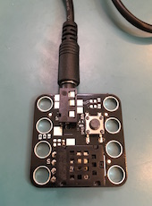

# Trafiklys

Dette er et forslag til en gruppeopgave for elever i udskolingen.  Overordnet set er opgaven at observere et rigtigt lyskryds, lave en model over hvordan det virker, og endeligt at implementere modellen i en forsøgsopstilling.


Opgaven kan bruges til at understøtte følgende læringsmål.

**Færdselslære**:

 - *Eleverne har viden om færdselsregler i samspil med andre trafikanter.*

**Matematik**:

- *Eleven kan planlægge og gennemføre problemløsningsprocesser.*
- *Eleven kan afgrænse problemstillinger fra omverdenen i forbindelse med opstilling af en matematisk model.*
- *Eleven kan gennemføre modelleringsprocesser, herunder med inddragelse af digital simulering.*

**Fysik/kemi**:

- *Eleven kan designe og gennemføre undersøgelser vedrørende elektronisk og digital styring.*
- *Eleven har viden om elektroniske kredsløb, simpel programmering og transmission af data.*
- *Eleven kan designe modeller for teknologiske processer, herunder med it-baserede programmer.*


## Redskaber

- Et klassesæt af [Mono'er](http://openmono.com).
- Fire computere med Arduino IDE og Mono-plugin installeret.
- Et stort fysisk kort som der må tegnes på, over nærområdet.

## Del 1: Grupper

Eleverne deles op i 4 grupper, og hver gruppe får til opgave at finde op til 4 lyskryds i nærheden vha. fysiske eller digitale kort.

Grupperne samles og plotter lyskrydsene ind på et stort fysisk kort.

Læreren tildeler et lyskryds til hver gruppe.

## Del 2: Planlægning

Hver gruppe skal planlægge hvordan de vil modellere et lyskryds.  Modellen skal beskrie hvordan et lyskryds fungerer i sin simpleste form med bare rød-gul-grøn i fire retninger.  De skal beslutte hvordan de vil notere, tage tid, fordele arbejdet, osv. når de kommer hen til trafikkrydset.

Grupperne samles og præsenterer kort for de andre hvordan de vil gribe det an.

## Del 3: Observationer

Grupperne går ud og fortager deres observationer.

## Del 4: Model

Grupperne sættes til at lave en (matematisk) model over hvordan et lyskryds fungerer, stadig i sin simpleste form med bare rød-gul-grøn i fire retninger.

Modellen kan passende være en tabel over hver unik tilstand når man ser lyskrydset som et samlet system, og hvor lang tid hver tilstand varer.  Et eksempel kunne være:

| Nord        | Øst        | Syd         | Vest       | Tid (s) |
| ----        | ----       | ---         | ---        | ---     |
| Rød         | Grøn       | Rød         | Grøn       | 10      |
| Rød         | Gul        | Rød         | Gul        | 1       |
| Rød         | Rød        | Rød         | Rød        | 1       |
| Rød+Gul     | Rød        | Rød+Gul     | Rød        | 1       |
| Grøn        | Rød        | Grøn        | Rød        | 10      |
| Gul         | Rød        | Gul         | Rød        | 1       |
| Rød         | Rød        | Rød         | Rød        | 1       |
| Rød         | Rød+Gul    | Rød         | Rød+Gul    | 1       |

Meningen er at modellen løbes igennem linie for linie, og startes forfra når der ikke er flere linier.

## Del 5: Opstilling

Hver gruppe får fire Mono'er med ledninger og en sammenkoblingsboks.  En af de fire Mono'erne skal forbindes over USB til en computer med Arduino IDE og Mono-plugin installeret.

Hver gruppe skal kopiere det trakfiklysprogram som hører til opgaven fra nettet ind i Arduino IDE'et.  Trafiklysprogrammet sørger for at tegne "pærerne" på skærmen, både for den Mono der bliver programmeret og for de Mono'er den vil blive koblet sammen med.

For at forsikre sig om at der "hul igennem", skal hver gruppe nu programmere alle fire Mono'er så de kører den forudprogrammerede tilstandsmaskine.  Den forudprogrammerede tilstandsmaskine viser bare det samme på alle fire Mono'er, og er derfor ikke en god model for et lyskryds.

## Del 6: Programmering

Trakfiklysprogram som hører til opgaven mangler "bare" at få indsat hvordan skiftene fra tilstand til tilstand skal foregå.  Så hver gruppe skal nu omsætte deres model til en tabel der styrer hele lyskrydset på en gang, dvs. alle fire Mono'er på en gang.

Det gøres ved at finde det sted i programmet som sætter tilstandsmakinen op:

```cpp
#include <mono.h>
#include <opgaver/trafiklys/traffic-light.h>

void setup() {
  static TrafficLight trafficlight;
  // ****************************************************************
  //                           EDIT HERE
  //
  //                     North       East        South       West        Time (ms)
  //
  trafficlight.newState( RED,        RED,        RED,        RED,        1000 );
  trafficlight.newState( RED+YELLOW, RED+YELLOW, RED+YELLOW, RED+YELLOW, 1000 );
  trafficlight.newState( GREEN,      GREEN,      GREEN,      GREEN,      1000 );
  trafficlight.newState( YELLOW,     YELLOW,     YELLOW,     YELLOW,     1000 );
  //
  // ****************************************************************
  trafficlight.start();
}

void loop() {
}
```

Hvis gruppen er kommet frem til den tilstandsmaskine som er vist i del 4, så vil programmet komme til at se således ud.  Bemærk at tiden er i millisekunder:

```cpp
// ****************************************************************
//                           EDIT HERE
//
//                     North       East        South       West        Time (ms)
//
trafficlight.newState( RED,        GREEN,      RED,        GREEN,      10000 );
trafficlight.newState( RED,        YELLOW,     RED,        YELLOW,     1000  );
trafficlight.newState( RED,        RED,        RED,        RED,        1000  );
trafficlight.newState( RED+YELLOW, RED,        RED+YELLOW, RED,        1000  );
trafficlight.newState( GREEN,      RED,        GREEN,      RED,        10000 );
trafficlight.newState( YELLOW,     RED,        YELLOW,     RED,        1000  );
trafficlight.newState( RED,        RED,        RED,        RED,        1000  );
trafficlight.newState( RED,        RED+YELLOW, RED,        RED+YELLOW, 1000  );
//
// ****************************************************************
```

## Del 7: Forsøg

Gruppen skal programmere alle fire Mono'er, sætte dem sammen, og vælge på skærmen af hver Mono "hvor" den er i trafikkrydset.


Det er Nord-siden der styrer de andre sider, og hver gang Nord tændes, så nulstiller den de andre.  Dvs. man kan nulstille opstillingen ved at tænde og slukke Nord med den lille knap på siden.

## Del 8: Verificering

Gruppen skal sammenligne den kørende opstilling med deres observationer.  Hvis de ikke har fået det til virke ligesom det de har observeret fra det rigtige trafiklys, så må de tilbage og lave om i programmet.


Hvis man forbinder en Mono direkte til en udviddelsesbrik med en knap, kan man nemmere finde ud af hvad der er galt med sin model.



Mono'en skal sættes til *ikke* at være Nord, således at den venter på at blive styret udefra.  Hver gang man trykker på knappen vil Mono'en nu skifte til næste tilstand.

Man kan også sætte udviddelsesbrikken til sammenkoblingsboksen i stedet for en af Mono'erne, således at udviddelsesbrikken agerer som styring for tre Mono'er på en gang.
